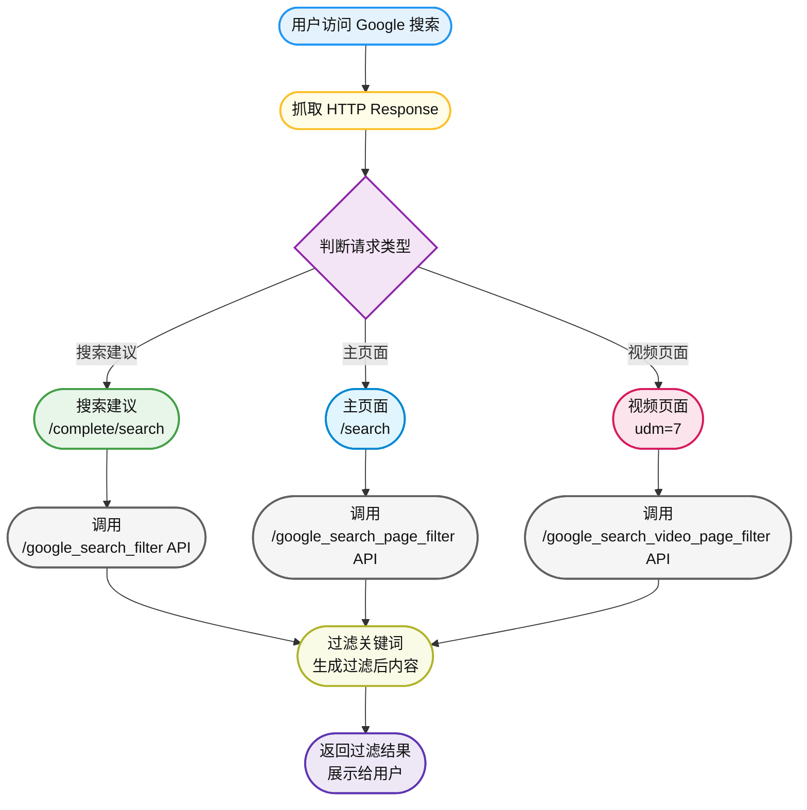
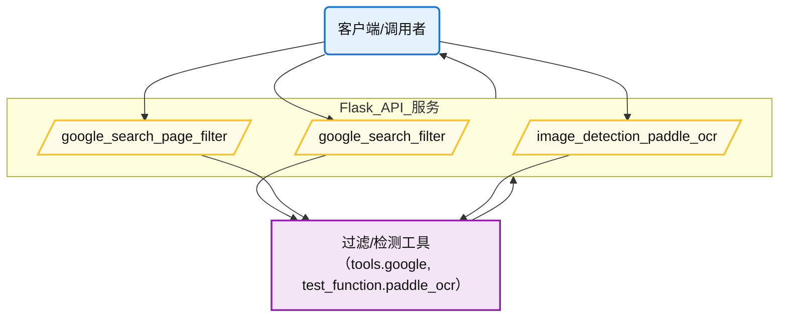

## Google 搜索过滤流程图

下图展示了用户访问 Google 搜索时，系统对不同类型请求的处理和过滤流程。

```mermaid
flowchart TD
    A([用户访问 Google 搜索]):::user
    B([抓取 HTTP Response]):::process
    C{判断请求类型}:::decision
    D1([搜索建议<br>/complete/search]):::type1
    D2([主页面<br>/search]):::type2
    D3([视频页面<br>udm=7]):::type3
    E1([调用<br>/google_search_filter API]):::api
    E2([调用<br>/google_search_page_filter API]):::api
    E3([调用<br>/google_search_video_page_filter API]):::api
    F([过滤关键词<br>生成过滤后内容]):::filter
    G([返回过滤结果<br>展示给用户]):::result

    A --> B
    B --> C
    C -->|搜索建议| D1
    C -->|主页面| D2
    C -->|视频页面| D3
    D1 --> E1
    D2 --> E2
    D3 --> E3
    E1 --> F
    E2 --> F
    E3 --> F
    F --> G

    classDef user fill:#e3f2fd,stroke:#2196f3,stroke-width:2px,color:#111;
    classDef process fill:#fffde7,stroke:#fbc02d,stroke-width:2px,color:#111;
    classDef decision fill:#f3e5f5,stroke:#8e24aa,stroke-width:2px,color:#111;
    classDef type1 fill:#e8f5e9,stroke:#43a047,stroke-width:2px,color:#111;
    classDef type2 fill:#e1f5fe,stroke:#0288d1,stroke-width:2px,color:#111;
    classDef type3 fill:#fce4ec,stroke:#d81b60,stroke-width:2px,color:#111;
    classDef api fill:#f5f5f5,stroke:#616161,stroke-width:2px,color:#111;
    classDef filter fill:#f9fbe7,stroke:#afb42b,stroke-width:2px,color:#111;
    classDef result fill:#ede7f6,stroke:#5e35b1,stroke-width:2px,color:#111;
```

## API 服务与工具调用关系图

下图展示了客户端与 Flask API 服务及其后端过滤/检测工具之间的调用关系。

```mermaid
graph TD
    Client(客户端/调用者):::client
    subgraph Flask_API_服务
        direction TB
        A1[/google_search_filter/]:::api
        A2[/google_search_page_filter/]:::api
        A3[/image_detection_paddle_ocr/]:::api
    end
    Tools[过滤/检测工具<br>（tools.google, test_function.paddle_ocr）]:::tools

    Client --> A1
    Client --> A2
    Client --> A3

    A1 --> Tools
    A2 --> Tools
    A3 --> Tools

    Tools --> Flask_API_服务
    Flask_API_服务 --> Client

    classDef client fill:#e3f2fd,stroke:#1976d2,stroke-width:2px,color:#111;
    classDef api fill:#fffde7,stroke:#fbc02d,stroke-width:2px,color:#111;
    classDef tools fill:#f3e5f5,stroke:#8e24aa,stroke-width:2px,color:#111;
```